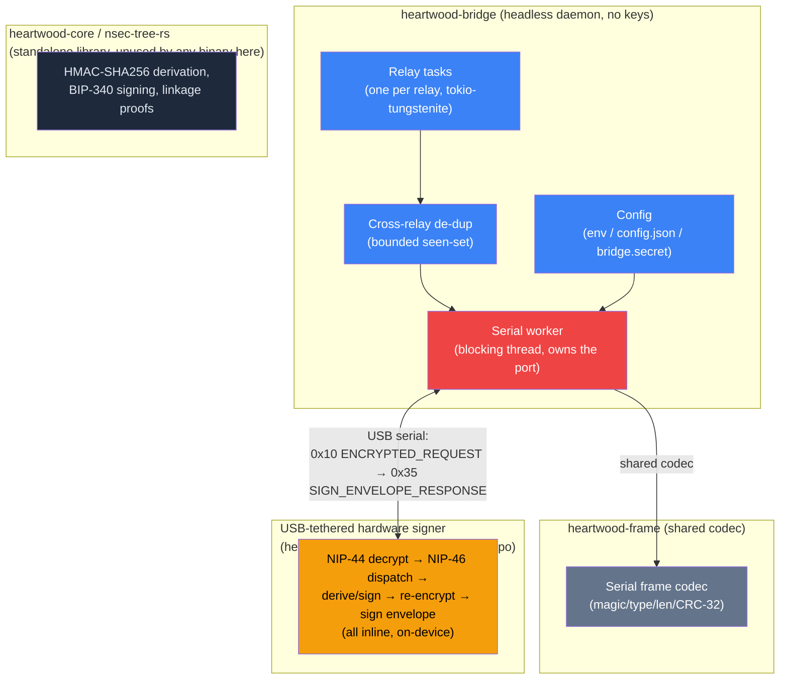

# Heartwood Architecture

> **This component is part of the [ForgeSworn Identity Stack](docs/ECOSYSTEM.md).** See the ecosystem overview for how it connects to the other components.

Heartwood is the relay-facing half of a hardware Nostr signer. The signing key lives only on a USB-tethered hardware device — an ESP32 or ESP8266 running the [`heartwood-esp32`](https://github.com/forgesworn/heartwood-esp32) firmware, or a Ledger running the [`heartwood-ledger`](https://github.com/forgesworn/heartwood-ledger) app — never on a general-purpose computer. This repo ships `heartwood-bridge`, a small headless Linux daemon that connects Nostr relays to that device over serial, plus the crates it is built from. There is no web UI, no PIN-protected key on disk, and no Tor hidden service: the bridge holds no key material and makes outbound relay connections only.

## Architecture overview

The repo has one runtime binary, `heartwood-bridge`, built from three crates:

- **`heartwood-bridge`** — the daemon. It subscribes to Nostr relays for kind:24133 requests addressed to the device's master pubkeys, de-duplicates the same request arriving from multiple relays, and pumps each one to the device over USB as a single `ENCRYPTED_REQUEST` (`0x10`) frame. The device does *all* of the cryptography inline — NIP-44 decryption, NIP-46 method dispatch, permission/policy checks, re-encryption, and signing — and hands back a fully-signed, ready-to-publish event as a `SIGN_ENVELOPE_RESPONSE` (`0x35`) frame, which the bridge republishes byte-for-byte to every relay. The bridge never decrypts a request, never constructs an event, and never touches key material.
- **`heartwood-frame`** — the shared binary serial frame codec (`magic "HW"` / type / big-endian length / IEEE CRC-32) used to talk to the device. It mirrors the canonical `no_std` codec in the firmware (`heartwood-esp32 common/src/frame.rs`), which is authoritative.
- **`heartwood-core`** (crate name `nsec-tree-rs`) — the deterministic nsec-tree derivation primitive (HMAC-SHA256 child derivation, BIP-340 signing, linkage proofs), kept in the workspace as a standalone reference/compatibility library with frozen cross-implementation test vectors. It is no longer a dependency of `heartwood-bridge` or of any binary in this repo — the same derivation logic now runs on-device, in the firmware.



See [`docs/2026-06-25-relay-serial-bridge.md`](docs/2026-06-25-relay-serial-bridge.md) for the full design note, including the serial frame contract and process shape.

## Why the bridge is thin

An earlier design had the bridge forward the device's response back for a second serial round-trip just to sign the outer envelope — this pushed ~7 KB over serial and caused silent ESP32 reboots. The current firmware signs the envelope inline on the first round-trip, so one request produces one response and the bridge does nothing but relay I/O:

```
relay  ──kind:24133 request────►  bridge  ──0x10 ENCRYPTED_REQUEST──►  device
relay  ◄──signed response (verbatim)──  bridge  ◄──0x35 SIGN_ENVELOPE_RESPONSE──  device
```

Policy enforcement — per-client TOFU approval, kind allowlists, rate limiting, session management — is entirely the device's job now, implemented in the firmware (`heartwood-esp32 firmware/src/policy.rs`). The bridge has no visibility into any of it beyond a NACK (`0x15`) if the device rejects a request.

## Configuration

No web UI, no setup wizard: `heartwood-bridge` is configured entirely from its environment and a data directory (default `/var/lib/heartwood`, overridable with `HEARTWOOD_DATA_DIR`):

| Source | Field | Purpose |
|--------|-------|---------|
| `HEARTWOOD_SERIAL_PORT` env, else `config.json`'s `serial_port` | e.g. `/dev/ttyUSB0` | Required — the serial device to talk to |
| `HEARTWOOD_RELAYS` env (comma-separated), else `config.json`'s `relays`, else a built-in default list | Relay URLs | Where to listen for requests and publish responses |
| `<data dir>/bridge.secret` | 64 hex chars or 32 raw bytes | The serial session secret, provisioned onto the box over USB by the `provision` CLI (in `heartwood-esp32`) — the same value the device holds in its NVS. Authenticates the USB session; it is *not* a signing key. |

`config.json` is a plain file (`{ "serial_port": "...", "relays": [...] }`) written by whoever sets the box up — there is no privileged process that owns it.

## Security model

| Leaves the bridge | Never touches the bridge |
|--------------------|---------------------------|
| Ciphertext (forwarded verbatim) | Plaintext requests/responses |
| Signed events (republished verbatim) | Master or derived private keys |
| Request timing/metadata (visible to relays regardless) | Encryption/decryption keys |

- **No key, no plaintext on the host.** All NIP-44 decryption, NIP-46 dispatch and signing happen on the USB-tethered device; the bridge only pumps ciphertext in and signed events out.
- **`bridge.secret`** authenticates the serial session (constant-time compared in firmware; setting it on the device requires a physical button hold). Treat the file as a local secret (mode 0600).
- **No inbound listener.** The bridge only makes outbound WebSocket connections to relays — no open ports, no Tor hidden service (Tor previously existed solely to front the now-deleted web UI).
- **NIP-42 AUTH is unsupported.** The bridge holds no key, so it cannot sign an auth challenge; relays that require AUTH for kind:24133 are out of scope.

## Deployment

Ships as a small headless Docker image (`Dockerfile`, multi-arch: aarch64/armv7/amd64) or a systemd service via the release install script. Either way the USB serial device is passed through and `/var/lib/heartwood` is mounted as persistent storage for `config.json` and `bridge.secret`. There is nothing to browse to — the box runs unattended once provisioned.

## Out of scope

The software-only signer use case — keys held in a browser or on a server rather than on dedicated hardware — is **not** part of this repo. That use case lives at [lite.mysignet.app](https://lite.mysignet.app).

## Integration points

- **[Bark](https://github.com/forgesworn/bark):** NIP-46 client. Connects via relay, sends signing requests; the device answers them directly (relayed by `heartwood-bridge`).
- **[Sapwood](https://sapwood.forgesworn.dev):** browser-based device configuration (Web Serial/USB) for most users — provisions identities, sets client policy, flashes firmware. This is the primary path for configuring the hardware.
- **`provision` CLI (in [`heartwood-esp32`](https://github.com/forgesworn/heartwood-esp32)):** the offline, air-gapped alternative to Sapwood — configures the device and writes `bridge.secret` over USB with no browser involved, for the highest-security, no-browser tier.
- **[nsec-tree](https://github.com/forgesworn/nsec-tree):** the key derivation protocol. `heartwood-core`/`nsec-tree-rs` re-implements the same HMAC-SHA256 scheme in Rust with frozen test vectors for byte-level compatibility; the firmware runs its own `no_std` port of the same scheme, which is what's actually in use today.
