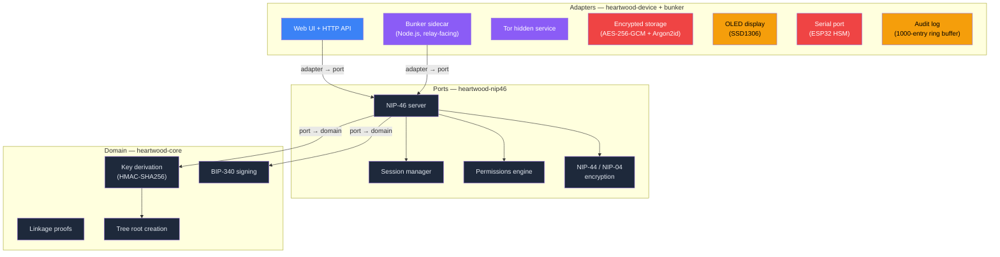

# Heartwood Architecture

> **This component is part of the [ForgeSworn Identity Stack](docs/ECOSYSTEM.md).** See the ecosystem overview for how it connects to the other components.

Heartwood is a dedicated Nostr signing appliance. It runs on a Raspberry Pi Zero 2 W, stores your master secret encrypted at rest, derives child identities via nsec-tree, and signs events over NIP-46. Accessible remotely via Tor hidden service.

## Architecture overview

The repo has two runtime components: a Rust binary (`heartwood-device`) and a Node.js sidecar (`bunker/`). The Rust side handles the web UI, storage, Tor, and OLED. The Node.js bunker sidecar connects to Nostr relays as a NIP-46 server, handling `connect` and `ping` itself and forwarding signing/derivation requests to the Rust crate library.

## Hexagonal architecture

The Rust workspace follows hexagonal architecture. Dependencies flow inward only: adapters depend on ports, ports depend on the domain core. The core has no I/O, no async, no network -- pure cryptography. The port layer translates NIP-46 protocol concerns without touching storage or the network. Adapters (the device binary and the bunker sidecar) own all I/O.



The bunker sidecar (`bunker/index.mjs`) connects to Nostr relays, handles NIP-46 `connect` and `ping`, and delegates signing/derivation to the Rust NIP-46 server. It has its own test suite (56 tests) and systemd unit (`heartwood-bunker@.service`).

## NIP-46 methods

Heartwood supports the standard NIP-46 methods plus 7 extensions for identity management:

| Method | Type | Description |
|--------|------|-------------|
| `connect` | Standard | Authenticate client (bunker sidecar) |
| `ping` | Standard | Keepalive (bunker sidecar) |
| `get_public_key` | Standard | Return active npub |
| `sign_event` | Standard | Sign a Nostr event |
| `nip44_encrypt` | Standard | NIP-44 encryption |
| `nip44_decrypt` | Standard | NIP-44 decryption |
| `nip04_encrypt` | Standard | NIP-04 encryption (deprecated) |
| `nip04_decrypt` | Standard | NIP-04 decryption (deprecated) |
| `heartwood_list_identities` | Extension | List all derived identities |
| `heartwood_derive` | Extension | Derive a new child identity |
| `heartwood_derive_persona` | Extension | Derive a named persona |
| `heartwood_switch` | Extension | Switch active signing identity |
| `heartwood_create_proof` | Extension | Create a linkage proof |
| `heartwood_verify_proof` | Extension | Verify a linkage proof |
| `heartwood_recover` | Extension | Scan for derived identities |

## Permission model

Per-client granularity:

- **Kind allowlists:** restrict which event kinds a client can sign
- **Method restrictions:** control access to standard and extension methods
- **Rate limiting:** 60 requests/minute per client
- **Session management:** max 32 concurrent sessions, 10-minute idle TTL

## Operational modes

| Mode | Master key location | Signing | Setup input |
|------|-------------------|---------|-------------|
| **bunker** | Encrypted on Pi | Pi signs | Existing nsec |
| **tree-mnemonic** | Encrypted on Pi | Pi derives + signs | BIP-39 mnemonic |
| **tree-nsec** | Encrypted on Pi | Pi derives + signs | Existing nsec (HMAC root) |
| **hsm** | ESP32 NVS | ESP32 signs via serial | Mnemonic/nsec via Sapwood |

## Storage

```
/var/lib/heartwood/{instance}/
  master.secret         # AES-256-GCM encrypted (Argon2id KDF)
  config.json           # Relays, Tor, client permissions
  audit.log             # Append-only request log
  tor-hostname          # .onion address
  bunker-uri.txt        # NIP-46 connection string
```

Multiple instances supported via systemd template units: `heartwood@personal.service`, `heartwood@work.service`.

Encryption uses AES-256-GCM with Argon2id key derivation (m=64MB, t=3, p=1). PIN-based unlock with exponential backoff (2s to 300s cap).

## Web UI

Single-page dark-themed interface served by Axum:

- **Setup wizard:** mode selection, mnemonic generation/recovery, nsec import, PIN setup
- **Locked state:** PIN entry with backoff display
- **Configured state:** master npub, bunker URI copy, Tor address, relay management, client approval

## Security model

| Leaves the device | Stays on the device |
|-------------------|---------------------|
| Signatures | Master secret |
| Public keys (npub) | Derived private keys |
| Linkage proofs (opt-in) | PIN |
| Audit log entries | Encryption keys |

All secrets wrapped in `zeroize::Zeroizing<[u8; 32]>` -- automatically overwritten on drop. Private keys never appear in logs, API responses, or the web UI.

## Integration points

- **[Bark](https://github.com/forgesworn/bark):** NIP-46 client. Connects via relay, sends signing requests, uses Heartwood extensions for persona management.
- **[Sapwood](https://github.com/forgesworn/sapwood):** Device management UI. Provisions master identities, manages client policies, handles firmware updates.
- **[nsec-tree](https://github.com/forgesworn/nsec-tree):** Key derivation protocol. heartwood-core re-implements the same HMAC-SHA256 scheme in Rust, with frozen test vectors ensuring byte-level compatibility.
