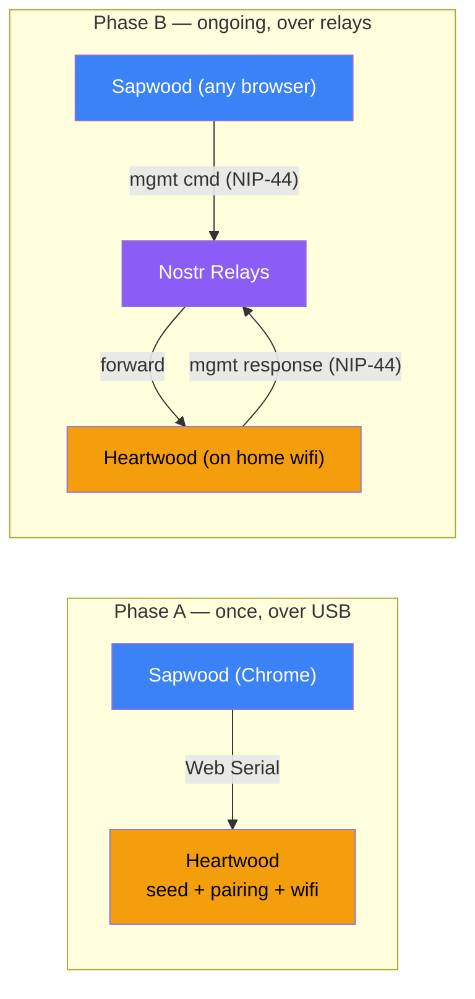

# Relay-mediated management

**Status:** Draft / Proposed — not yet decided or implemented.
**Date:** 2026-06-19
**Supersedes (partially):** the "Tor hidden service by default" reachability posture described in `README.md`. See [Relationship to Tor-by-default](#relationship-to-tor-by-default).

> **Provenance.** This note reconstructs a design direction — "flash in Chrome, then set up over Nostr relays" — recalled from a conversation that isn't captured anywhere in the repo. A thorough search (2026-06-19) of heartwood (tracked, gitignored `docs/plans/`, deleted docs recovered from history, all branches, `llms*.txt`), plus the sibling **sapwood** and **bark** repos, found the *flash-in-Chrome* half documented (Sapwood's Web Serial provisioning) but the *setup-over-relays* half **nowhere — and the opposite explicitly stated**:
>
> > "The bridge … is only used for NIP-46 relay connectivity — that is, for signing requests arriving over Nostr. **Sapwood replaces the bridge for local management only.**" — `sapwood/llms-full.txt:34`
>
> So the documented split today is: **management = local (Web Serial / HTTP), signing = relays**. This note therefore proposes a **deliberate reversal** of that decision, not a gap-fill. Treat everything below as a proposal to react to, not settled architecture.

---

## The vision

> "When you can flash and config via web, like Meshtastic, and it can sit on the home wifi, auto-signing — then that is the game changer."

The onboarding experience we want:

1. Plug the device into a laptop, open a web page, click **Flash**.
2. Enter wifi credentials in the browser.
3. Unplug. The device sits on the shelf on home wifi.
4. Configure it — derive personas, pair clients, set policies — from any browser, anywhere, without ever being on the same network as it again.
5. It just signs.

## What already exists (per `ECOSYSTEM.md`)

- **Sapwood** — browser management UI (TypeScript/Svelte), connects via **Web Serial (USB)** or **HTTP**.
- **ESP32 HSM tier** — Sapwood provisions the master secret over USB straight into ESP32 NVS. The secret never touches a general-purpose computer or the network.
- **Signing over relays** — NIP-46 already rides Nostr relays end to end (Bark → relay → Heartwood), NIP-44 encrypted.
- **TOFU client policies** — auto-approve / ask / per-kind allowlists / 60-req-min rate limit.

So "flash in Chrome" is a designed capability (Web Serial provisioning). The missing half is **management** travelling over relays instead of USB/LAN.

## What's missing

Today's provisioning and ongoing management are **USB or HTTP over the LAN bridge** (`ECOSYSTEM.md:57`, sequence diagram at `:91`). That means:

- To configure the device after first boot you must either keep it plugged in over USB, or reach it on the LAN (`http://<host>.local:3000`), or expose it via the Tor hidden service.
- Each of those is either inconvenient (USB/LAN proximity) or adds an **inbound listener** to a device whose whole job is to hold secrets.

## Prior art: the `feat/wifi-standalone` branch (in progress, unmerged)

There is concrete in-progress work toward the home-wifi vision, spread across two repos on matching `feat/wifi-standalone` branches (both **local-only, unpushed, unmerged**). It takes the *USB-config* path, not the relay-management path proposed here.

**Sapwood** (`feat/wifi-standalone`, 3 commits) — complete, wired, tested:
- `SET_NET_CONFIG` frame `0x54`, payload `NetConfig { ssid, password, relays[], mode: 'usb' | 'wifi' }` (`src/lib/frame.ts`).
- A **Connectivity** panel (`src/components/Connectivity.svelte`) offering two modes: **USB-bridged (radio off)** — the "high-assurance default" — and **WiFi-standalone** — labelled the "convenience tier".
- `configureNetwork()` sends the frame over **serial/USB only**, never HTTP (`src/lib/device.svelte.ts`), 60 s timeout for button approval.

**heartwood-esp32** (`feat/wifi-standalone`, 5 commits) — config plane done, signing plane not:
- `FRAME_TYPE_SET_NET_CONFIG = 0x54` (`common/src/types.rs:74`), `NetConfig` parser (`common/src/net_config.rs`), NVS persistence (`net_config_store`), boot-time read, OTA partitions bumped to 2 MB for the larger wifi binary.
- **The gap** — `firmware/src/main.rs:182`: `// Plan 2: if cfg.device_mode() == DeviceMode::Wifi { spawn relay task with cfg }`. The device **stores** the wifi/relay config but does **not yet bring up wifi or connect to relays**. The standalone signing loop does not exist.

**heartwood (Pi)** has no `0x54` handling — and that is *correct*: in wifi-standalone the ESP32 talks to relays directly and the Pi bridge is out of the loop. The Pi-side frame code (`crates/heartwood-device/src/web.rs`, only `SET_PIN 0x25` / `ACK` / `NACK`) serves the USB-bridged tier.

**Feasibility spike outcome (`heartwood-esp32:spike/wifi-heap`, 8 Jun, throwaway).** The single spike commit ("WiFi+TLS heap/size feasibility — do not merge") closed two of three risks and left one open. Target is **ESP32-S3** (Heltec WiFi LoRa 32 V3/V4), not a classic ESP32.

| Risk | Status | Detail |
|---|---|---|
| **Flash size** | ✅ Resolved — fits | WiFi+TLS image **1.69 MB** vs 1.04 MB baseline (+0.65 MB). Fits the 2 MB OTA slot with **15 % headroom**; would *not* have fit the old 1.5 MB slot — hence the partition bump already on `feat/wifi-standalone` (`029472fc`). |
| **Toolchain** | ✅ Found & fixed — but **stranded** | Once WiFi grew the binary, secp256k1-sys hit `dangerous relocation: call8 … out of range`. Fixed with `CFLAGS_…="-mlongcalls"` for the cc-built FFI crates. **The fix lives only on the do-not-merge spike branch's `.cargo/config.toml`** — it must be ported to `feat/wifi-standalone`, or it will be re-discovered painfully. It is also a correctness fix worth landing regardless of wifi. |
| **Heap / RAM** | ✅ **Measured 2026-06-19 on a Heltec V4 — live concurrent peak FITS** | On-hardware: associated to a live AP, **real TLS handshake** to `relay.trotters.cc` (HTTP 200), then allocated the 130 KB signing set **alongside the live TLS session**. At that true peak: **free = 70 KB, largest block = 31 KB**, no OOM. A live relay TLS session costs **~31 KB**; the 130 KB signing set is the dominant consumer. Verdict: wifi-standalone is **viable on the S3 without PSRAM**. |

**Resolved — the live handshake fits.** Measured on hardware (real association to `VM0030073`, real TLS to `relay.trotters.cc` returning HTTP 200): with wifi + a **live TLS session** + the 130 KB signing set all resident, **70 KB free / 31 KB largest block** remain. The handshake itself cost ~31 KB (mbedTLS session/record buffers); the signing set is the dominant ~130 KB. The true concurrent peak is positive with real headroom — wifi-standalone is a **go** on the V4, no PSRAM required.

**The one thing to watch is *multiple simultaneous relay connections.*** Each live relay TLS session costs ~31 KB. From the 70 KB peak headroom, a second concurrent relay (~31 KB) leaves ~40 KB; a third gets tight (~9 KB). So **1–2 relays concurrently is comfortable**; more wants sequential connect, fewer concurrent relays, or PSRAM. Single-relay wifi-standalone needs nothing extra.

Full ladder (Heltec V4, S3, no PSRAM): start 287 KB → after EspWifi 242 → after associate+DHCP 238 → after TLS client 236 → **after live handshake 204** → **+130 KB signing set → 70 KB free (31 KB largest block)**.

**Why this matters for *this* proposal:** relay-mediated *management* needs the **same** on-device wifi + TLS + websocket stack that wifi-standalone *signing* needs. So that one heap measurement gates **both** directions. Resolve it before committing to either. The fallback if heap is too tight is **not** a different chip (it is already an ESP32-S3) — it is **enabling PSRAM** (the Heltec V4 has it; the spike deliberately measures the PSRAM-off worst case), or keeping the radio on the Pi rather than the ESP32.

## Proposal: relays as the universal control plane

Split the device's lifecycle at the secret boundary.

### Phase A — local provisioning (Web Serial, once)

Performed over USB from Sapwood in Chrome. This is the *only* phase that handles the seed.

- Inject the master secret (mnemonic / nsec / generate-on-device) — **secret stays on USB, never reaches a relay**.
- Seed a **pairing secret** shared between the device and the operator (used to bootstrap the management channel — see [Pairing](#pairing--trust-bootstrap)).
- Write wifi credentials and the device's chosen management relays.

### Phase B — relay-mediated management (everything after)

Once the device is on wifi it holds an **outbound** subscription to its management relays — the same kind of connection NIP-46 signing already uses. Sapwood reaches it through that encrypted channel:

- Derive / rename / revoke personas.
- Set TOFU client policies and kind allowlists.
- Fetch logs and health.
- Trigger OTA (with physical-button confirmation on the hardware tiers).

No USB. No LAN proximity. No inbound port.

## Why this beats the alternatives

| Reachability for management | Inbound listener on device? | Proximity required? | Notes |
|---|:-:|:-:|---|
| USB / Web Serial | No | Yes (physical) | Fine for Phase A, not for ongoing config |
| LAN bridge (`*.local:3000`) | **Yes** (HTTP) | Yes (same network) | Exposes a port on the signing device |
| Tor hidden service | **Yes** (onion) | No | Inbound onion service to maintain |
| **Relays (this proposal)** | **No** | No | Device only ever connects *out* |

The decisive property: the device **never needs an inbound listener**. It is a pure relay client for both signing and management. That is a strictly smaller attack surface than LAN-inbound or Tor-inbound, and it removes "be on the same wifi" from the UX.

## The firm constraint

**The seed never transits a relay — not even NIP-44-wrapped.** Secret injection lives in Phase A, over USB, exactly as the documented HSM path already insists. Phase B carries *management* (derivation requests, policy, logs), never raw key material. Derivation happens on-device; only the resulting public keys and signatures leave.

If we ever want seedless remote recovery, that is a separate design with its own threat model — out of scope here.

## Pairing / trust bootstrap

The management channel needs the device and Sapwood to share a secret so neither relays nor third parties can issue management commands.

- **Primary:** the pairing secret seeded over USB in Phase A. Sapwood keeps it (or a derived management keypair); the device authorises management events signed by / encrypted to that pair. This is the clean path — trust is established on the wire that never leaves the room.
- **Fallback (no second USB session):** display a pairing code / QR on the device's OLED (where present) or in the Phase-A flow, entered into a fresh Sapwood instance.

Management events should be a **distinct, namespaced event kind** from NIP-46 signing requests, with their own permission gate — a paired *signing* client must not be able to issue *management* commands.

## Relationship to Tor-by-default

The README currently leads with "reachable over Tor by default … no port forwarding, no router configuration." Relay-mediated reachability for both signing and management makes the inbound Tor hidden service **optional rather than foundational**:

- Relays already give location-hidden, NAT-traversing reachability without an inbound listener.
- Tor's remaining value becomes **relay-connection privacy** — hiding the device's IP from the relays it connects out to — which is a connection-level concern (route relay websockets over Tor), not an inbound hidden service.

**Action once decided:** update `README.md` and `ECOSYSTEM.md` to reframe reachability as "relays by default, Tor optional for relay-connection privacy." Not done here — Tor-inbound is what currently ships, and the README should not claim an architecture we haven't built.

## Threat model deltas

- **Relay operator** sees encrypted blobs plus metadata: that a device exists, message timing, which relays it favours. Same exposure NIP-46 signing already accepts — no new secret leakage, but management traffic adds a metadata channel (e.g. "configuration happened at time T").
- **Compromised Sapwood / stolen pairing secret** can issue management commands within the paired scope. Mitigate with physical-button confirmation for destructive ops (provision / reset / OTA) on the hardware tiers, as already drawn in `ECOSYSTEM.md:206`.
- **Relay censorship / liveness** — if all configured relays drop the device, it is unmanageable until it reaches one. Mitigate with multiple management relays and a LAN/USB fallback that remains available but is not the default path.
- **Replay** — management events need nonce/timestamp + expiry (NIP-40) and an on-device seen-set, so a captured "derive persona" or "revoke client" can't be replayed.

## Relay management protocol — concrete spec

What lets you **create clients / manage the device over relays with no inbound listener** — no Tor hidden service, no open LAN port. Sits on top of Plan 2 (the device must already run its own relay + NIP-46 loop in wifi-standalone).

### Trust model

| Key | Held by | Established | Role |
|-----|---------|-------------|------|
| **operator key** (`op_mgmt`) | you (Sapwood) | baked into the config blob **at flash time** | the *sole* authority allowed to manage this device |
| **device key** (`dev_mgmt`) | the device | derived from the master via nsec-tree (reserved purpose `"management"`) | the device's management identity / address |

Bootstrap is physical (flash + provision over USB); everything after is remote. The device surfaces `dev_mgmt`'s npub at provision time (OLED / Sapwood) so you know where to address it.

### Transport

- **New event kind `24134`** — ephemeral, distinct from NIP-46's `24133`. A clean permission boundary, not a method bolted into the signing envelope.
- **NIP-44 encrypted**, request/response, exactly like NIP-46 but management-scoped.
- **Request:** author `op_mgmt`, `p`-tag `dev_mgmt`, content = encrypted `{id, method, params}`.
- **Response:** author `dev_mgmt`, `p`-tag `op_mgmt`, content = encrypted `{id, result | error}`.
- **Outbound-only:** the device holds an outbound subscription on its configured relays for kind `24134` p-tagged to `dev_mgmt`, and publishes responses. **No inbound listener** — that's the win: full management reachability with zero open ports.

### Authentication & replay

The device executes a command **only if all** of:

1. the event author == the **baked `op_mgmt`** pubkey (the one and only authority), and
2. it decrypts cleanly under NIP-44 (`dev_mgmt` ⇄ `op_mgmt`), and
3. it is fresh — `created_at` within ±N s, a unique `id` not in the bounded **seen-set**, and an unexpired NIP-40 `expiration` tag.

Encryption gives confidentiality; **(1) is the security crux** — a relay or third party can't forge a command because it isn't signed by `op_mgmt`. Replay is closed by (3). This is why management is a distinct authenticated channel, not "signing-but-also".

### Method set (maps the ops that already exist on USB)

Routine client/policy management — safe to do remotely:

| Method | Maps to frame | Effect |
|--------|---------------|--------|
| `list_clients` | `CONNSLOT_LIST` (0x42) | list connection slots (secrets redacted) |
| `create_client` | `CONNSLOT_CREATE` (0x40) | new slot → returns bunker URI + secret |
| `update_client` | `CONNSLOT_UPDATE` (0x44) | change a slot's policy / label |
| `revoke_client` | `CONNSLOT_REVOKE` (0x46) | revoke a slot |
| `get_bunker_uri` | `CONNSLOT_URI` (0x48) | bunker URI for a slot |
| `set_policy` / `list_policy` | `POLICY_*` (0x27–0x2A) | per-client kind / method policy |
| `get_status` | — | health, identity count, relay state |

### The line that does NOT move to relays (stays USB / physical)

Anything that changes the trust root or touches the seed:

- **Provisioning the master seed** — USB/flash only; the seed never touches a relay (the firm constraint, unchanged).
- **Rotating `op_mgmt`** — USB/physical, else a stolen `op_mgmt` could lock you out by rotating itself.
- **Factory reset / wipe** — USB/physical; a remote wipe is a denial-of-service vector.
- **Changing wifi/relays** (`SET_NET_CONFIG`) — USB/flash; a bad remote net-config could strand the device off its relays.

So: **create/manage clients = remote over relays; seed and trust-root changes = physical.** That split *is* the security model.

### The physical-confirmation trade

A plugged-in device can demand a button press per sensitive op; a device on a shelf can't. WiFi-standalone therefore substitutes **`op_mgmt` cryptographic authority** for physical confirmation on routine ops — which makes `op_mgmt`'s protection load-bearing (keep it in a real signer / hardware key, not a hot browser tab long-term). Destructive ops stay physical per the line above.

### Sequencing

1. **Plan 2 first** — the device's own relay + NIP-46 signing loop in wifi-standalone (proven to fit: 70 KB peak). Management rides the same relay client.
2. **Then this** — add the `24134` kind + auth + dispatch to the connslot/policy handlers that already exist on the USB path.
3. **Flasher** — bake `op_mgmt` into the config blob; surface `dev_mgmt`'s npub after provisioning.

## Open questions

1. **Management event kind** — proposed `24134` (ephemeral, distinct from NIP-46's `24133`) above; confirm no clash and decide whether to seek a NIP or keep it project-local.
2. **Does relay-management fully replace the LAN web wizard, or coexist?** Proposed: coexist — LAN/USB stays as the offline fallback, relays become the default.
3. **Where does the management keypair live in Sapwood** — browser storage, or a Bark-style extension? Affects the "configure from any browser" promise.
4. **OTA over relays** — chunked firmware via relays is heavy and metadata-leaky. Likely keep OTA on USB/LAN and only *trigger* it over relays.
5. **Multi-operator** — one device, several paired Sapwood instances? Useful for recovery, expands the trust set.

## Touch points (rough)

- `heartwood-device` — outbound management subscription; management dispatch; seen-set / replay guard; pairing-secret storage from Phase A.
- `heartwood-nip46` (or a sibling) — management event kind, encode/decode, permission gate distinct from signing.
- **Sapwood** — relay transport alongside Web Serial/HTTP; pairing-secret capture in the flash flow; management keypair.
- **Web Serial flash flow** — extend Phase A to write wifi creds + pairing secret + management relays, not just the seed.
- Relatedly: the parked `dev-CORS` stash on this branch is the LAN-bridge web-app path. If relays become the default management transport, that cross-origin LAN config matters less — but the unresolved permissive-CORS smell should still be tightened, not shipped as-is.
