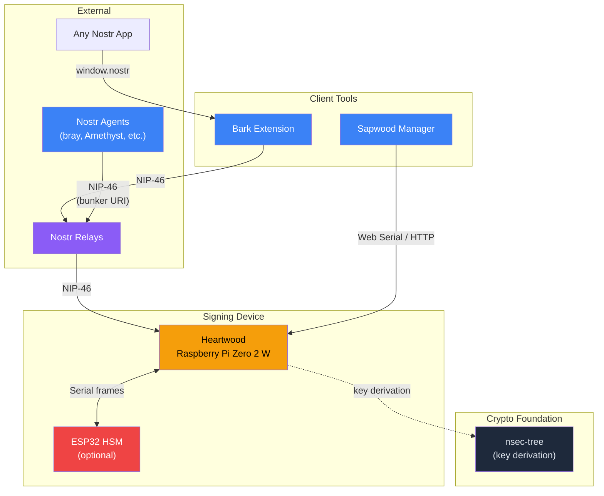
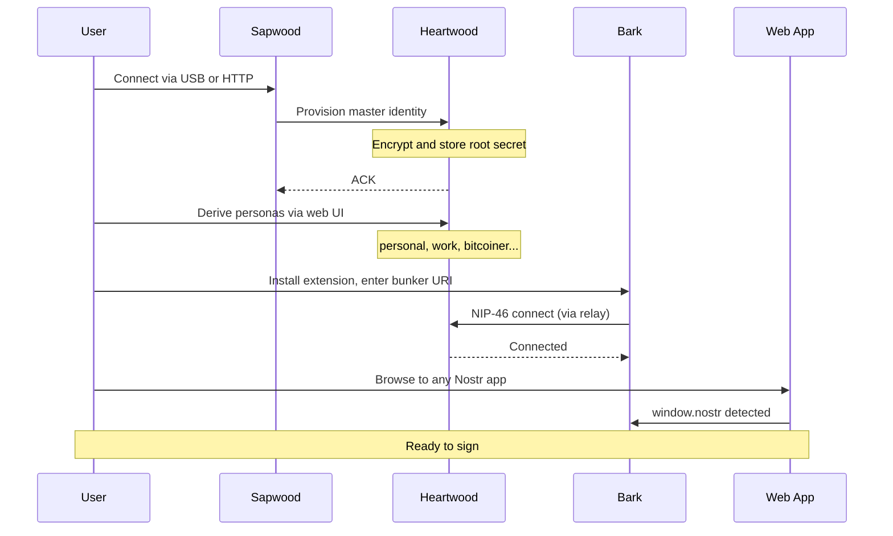
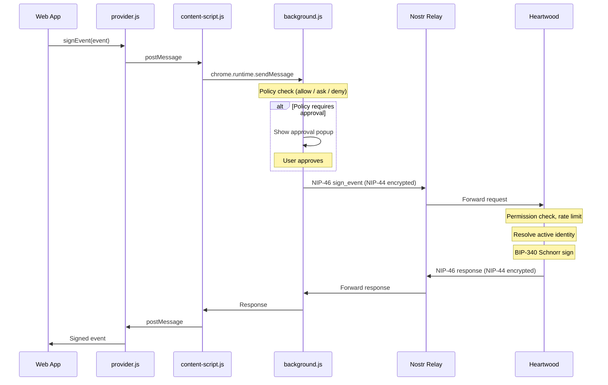
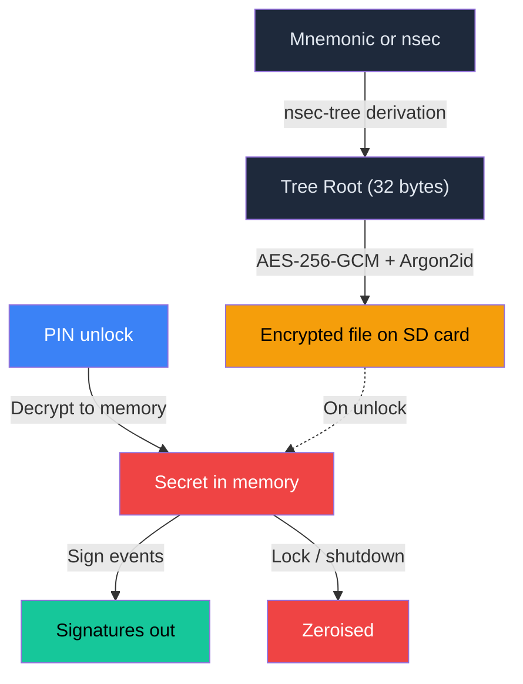
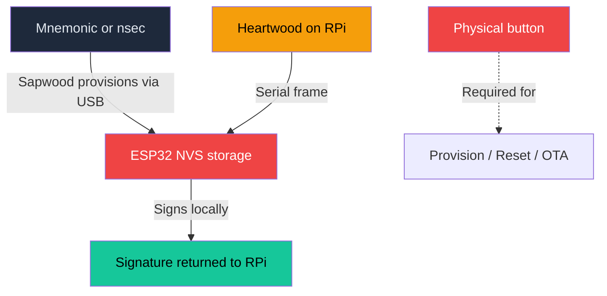
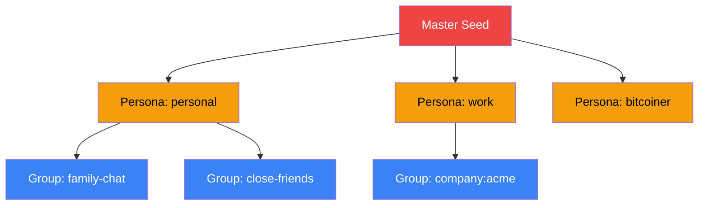

# The ForgeSworn Identity Stack

Your keys never leave the device.

The ForgeSworn identity stack is a set of open source tools that move Nostr key management off your laptop and onto dedicated hardware. One mnemonic seed generates unlimited unlinkable identities, signed on a device you control, accessible from any browser through standard APIs.

**Bark** is a browser extension that provides the standard `window.nostr` API (NIP-07). It holds no keys. Every signing request is forwarded over NIP-46 to your Heartwood device. Bark is one way in -- any NIP-46 client (bray, Amethyst, or any agent with a bunker URI) can connect directly to Heartwood via relay without Bark.

**Heartwood** is a dedicated signing appliance running on a Raspberry Pi Zero 2 W. It stores your master secret (encrypted at rest with AES-256-GCM + Argon2id), derives child identities using nsec-tree's HMAC-SHA256 scheme, and signs events with BIP-340 Schnorr. Accessible over Tor.

**Sapwood** is a browser-based management UI for provisioning, policy management, and firmware updates. Connects via Web Serial (USB) or HTTP (bridge on the Pi). 21 KB gzipped.

**ESP32 HSM** is an optional hardware security module. In HSM mode, the Pi stores nothing and forwards signing requests to the ESP32 over serial. Provisioning and factory reset require a physical button press.

**nsec-tree** is the cryptographic foundation. A deterministic key derivation library that creates unlimited child identities from a single seed using HMAC-SHA256. Implemented in TypeScript (npm) and Rust (heartwood-core).

---

## Setting up for the first time

Provisioning a Heartwood device takes about five minutes. You generate or import a master identity, derive personas for different contexts, and connect Bark.

Three provisioning modes are available:

| Mode | Input | Key storage | Use case |
|------|-------|-------------|----------|
| **Tree (mnemonic)** | 12/24-word BIP-39 seed | Derived root on device | New master identity from scratch |
| **Tree (nsec)** | Existing nsec | HMAC-derived root on device | Existing Nostr identity |
| **HSM** | Mnemonic or nsec via Sapwood | Secret on ESP32 only | Maximum isolation |

In all modes, the private key never touches a general-purpose computer.

---

## Signing an event

When a web app calls `window.nostr.signEvent()`, the request travels through Bark's message chain, across a Nostr relay, into Heartwood, and back with a signature. The private key never leaves the device.

All relay traffic is NIP-44 encrypted (XChaCha20 + HMAC-SHA256). Heartwood enforces per-client permissions (kind allowlists, method restrictions) and rate limits (60 requests/minute). Requests have a 60-second timeout to allow for physical approval on hardware devices.

The nsec is never included in any response. Only signatures and public keys leave the device.

---

## Where do secrets live?

The most important question for any signing architecture: where is the key material?

### Software mode (Raspberry Pi only)

The master secret is encrypted at rest on the Pi's SD card. It's only decrypted into memory when the device is unlocked with a PIN.

All secrets in memory are wrapped in zeroising containers and overwritten on lock or shutdown.

### HSM mode (Raspberry Pi + ESP32)

The Pi stores nothing. The ESP32 holds the master secret in its non-volatile storage. The Pi acts as a network proxy, forwarding NIP-46 requests to the ESP32 over serial.

Compromising the Pi in HSM mode yields zero key material. The ESP32 requires a physical button press for all destructive operations (provisioning, factory reset, firmware update).

---

## One seed, many identities

A single mnemonic generates an unlimited tree of unlinkable Nostr identities using nsec-tree's HMAC-SHA256 derivation. Each persona appears as an independent keypair to outside observers.

**Unlinkable by default.** No observer can prove two personas share a master without a linkage proof. Derivation is one-way (HMAC-SHA256), so compromising a child reveals nothing about the parent or siblings.

**Selective disclosure.** When you want to prove ownership across personas, nsec-tree creates BIP-340 Schnorr linkage proofs. Blind proofs hide the derivation path. Full proofs reveal it. You choose.

**Compromise blast radius:**

| Compromised | Blast radius | Recovery |
|-------------|--------------|----------|
| Group key | Only that group | Rotate to new index |
| Persona key | That persona and its groups | New persona index, publish blind proof |
| Master seed | Everything | New mnemonic, migrate all identities |

Bark's popup UI lets you switch between personas and derive new ones without leaving the browser. The active identity is managed by Heartwood, so switching is instant and consistent across all connected apps.

---

## Components

| Component | Role | Language | Architecture |
|-----------|------|----------|--------------|
| [Heartwood](https://github.com/forgesworn/heartwood) | Dedicated signing device | Rust | [ARCHITECTURE.md](../ARCHITECTURE.md) |
| [Bark](https://github.com/forgesworn/bark) | Browser extension (NIP-07) | JavaScript | [ARCHITECTURE.md](https://github.com/forgesworn/bark/blob/main/ARCHITECTURE.md) |
| [Sapwood](https://github.com/forgesworn/sapwood) | Device management UI | TypeScript / Svelte | [ARCHITECTURE.md](https://github.com/forgesworn/sapwood/blob/main/ARCHITECTURE.md) |
| [nsec-tree](https://github.com/forgesworn/nsec-tree) | Key derivation library | TypeScript | [ARCHITECTURE.md](https://github.com/forgesworn/nsec-tree/blob/main/ARCHITECTURE.md) |

**Ecosystem-adjacent libraries** that build on nsec-tree:
- [canary-kit](https://github.com/forgesworn/canary-kit) -- duress-resistant verification using nsec-tree group keys
- [spoken-token](https://github.com/forgesworn/spoken-token) -- voice verification tokens bound to persona pubkeys
