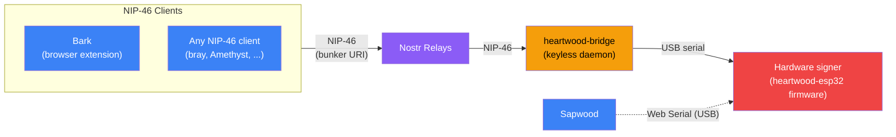
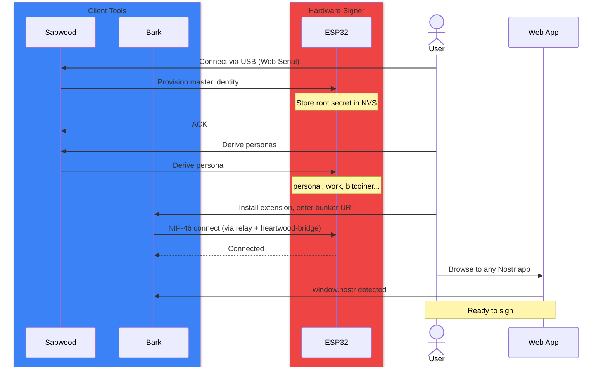
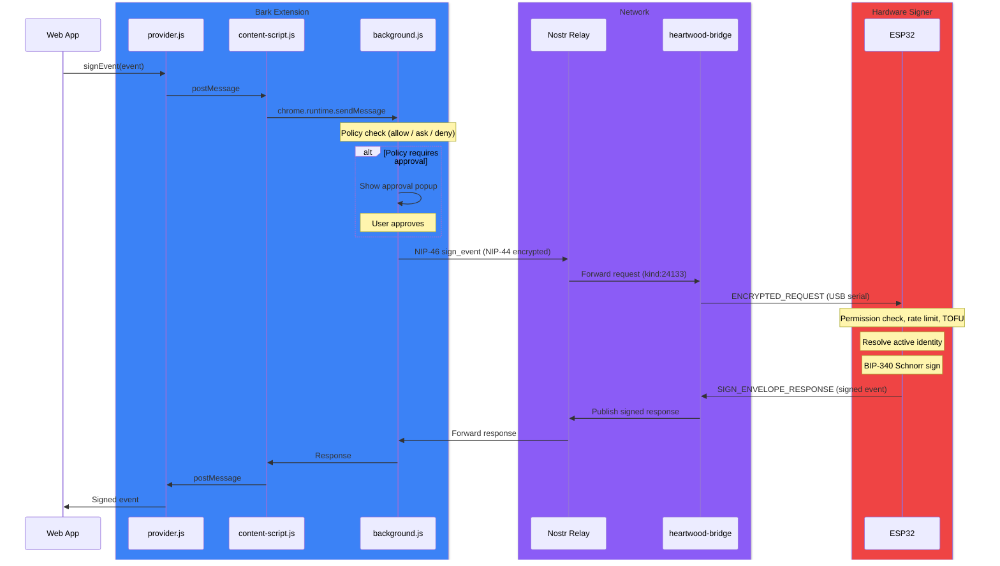
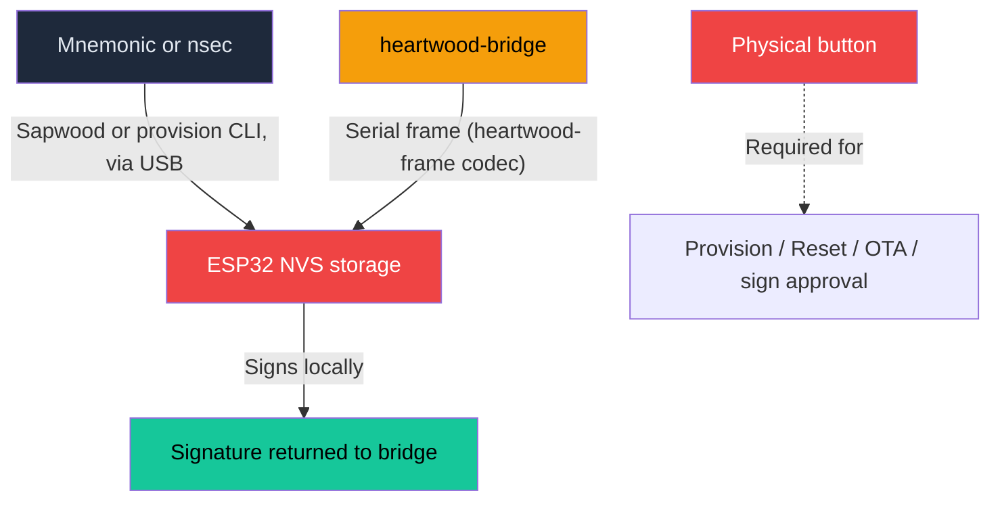
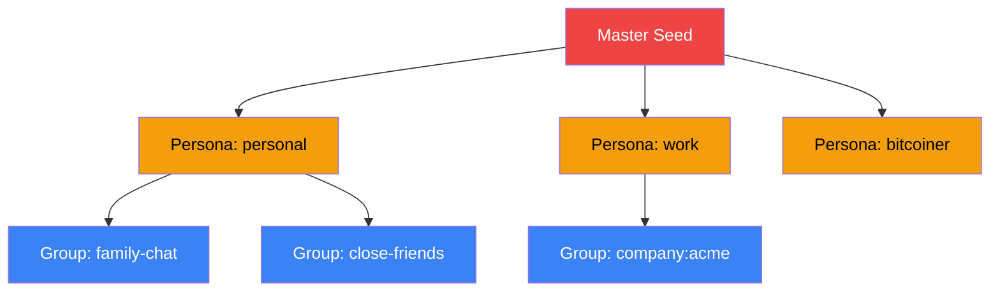

# The ForgeSworn Identity Stack

Your keys never leave the device.

The ForgeSworn identity stack is a set of open source tools that move Nostr key management off your laptop and onto dedicated hardware. One mnemonic seed generates unlimited unlinkable identities, signed on a device you control, accessible from any browser through standard APIs.

Any NIP-46 client can connect to the hardware signer via a bunker URI. Bark provides `window.nostr` for browser apps. Agents like bray connect directly. The client doesn't need to know what's behind the bunker URI: `heartwood-bridge` listens on the relays and pumps ciphertext to and from the USB-tethered signer, never holding key material or seeing plaintext itself.

**heartwood-bridge** is a headless, keyless daemon -- this repo's product. It connects to Nostr relays, forwards NIP-46 requests over USB to the hardware signer, and republishes whatever the signer signs. It runs no web server, opens no inbound ports, and stores no key material; a fully compromised bridge host cannot extract keys or forge signatures. The serial wire format (magic/type/length/CRC-32) is implemented once in the shared `heartwood-frame` crate, so the bridge's codec can't drift from what it sends over USB.

| Component | Key material | Signing | Attack surface |
|-----------|--------------|---------|-----------------|
| **heartwood-bridge** | None -- forwards NIP-44 ciphertext only | Never signs; pumps requests to the signer | Bridge compromise = no key access |
| **Hardware signer** | Master secret in NVS | Signs locally, physical button required for out-of-policy requests | Requires physical access to the device |

**Sapwood** (sapwood.forgesworn.dev) is a browser-based flasher and admin console. It provisions master identities, manages TOFU client policies, flashes firmware, and monitors logs -- all over Web Serial (USB), talking directly to the hardware signer. 21 KB gzipped.

**nsec-tree** is the cryptographic foundation. A deterministic key derivation library that creates unlimited child identities from a single seed using HMAC-SHA256. Implemented in TypeScript (npm) and Rust (`heartwood-core` / `nsec-tree-rs`), kept in this repo as a standalone reference library -- `heartwood-bridge` never touches key material, so it doesn't depend on it. The hardware signer firmware (in the separate `heartwood-esp32` repo) performs the same derivation on-device.

A software-only signer -- keys held in a browser or server rather than dedicated hardware -- lives at [lite.mysignet.app](https://lite.mysignet.app). It's a separate product and out of scope for this repo.

## TOFU client approval

When a new NIP-46 client connects for the first time, it isn't automatically trusted. The hardware signer holds a connection slot table with per-client policies, enforced entirely on-device:

- **Auto-approve:** trusted clients sign without prompting
- **Ask:** out-of-policy requests block for a physical button press on the signer (up to ~45 seconds)
- **Kind restrictions:** per-client allowlists for which event kinds can be signed
- **Rate limiting:** 60 requests/minute per client

First connection requires approval (TOFU). After that, the client's pubkey is remembered and policies apply. Revoking a client removes it from the slot table. `heartwood-bridge` never sees or enforces any of this -- it only pumps ciphertext and de-duplicates requests across relays; every policy decision happens on the device.

---

## Setting up for the first time

Provisioning a hardware signer takes about five minutes. You generate or import a master identity, derive personas for different contexts, and connect Bark.

Two provisioning paths are available:

| Path | Input | Key storage | Use case |
|------|-------|-------------|----------|
| **Sapwood (Web Serial)** | 12/24-word BIP-39 mnemonic or existing nsec | Derived/HMAC root in ESP32 NVS | Everyday setup from a browser |
| **`provision` CLI (heartwood-esp32, air-gapped)** | 12/24-word BIP-39 mnemonic or existing nsec | Same on-device storage | Offline, high-security provisioning -- no browser, no network |

In both paths, the private key is written straight into the hardware signer's own storage and never touches a general-purpose computer.

---

## Signing an event

When a web app calls `window.nostr.signEvent()`, the request travels through Bark's message chain, across a Nostr relay, through `heartwood-bridge` over USB, into the hardware signer, and back with a signature. The private key never leaves the device.

All relay traffic is NIP-44 encrypted (XChaCha20 + HMAC-SHA256). The hardware signer enforces per-client permissions (kind allowlists, method restrictions) and rate limits (60 requests/minute). Requests have a 60-second timeout to allow for physical approval on the device.

The nsec is never included in any response. Only signatures and public keys leave the device.

---

## Where do secrets live?

The most important question for any signing architecture: where is the key material?

The host running `heartwood-bridge` stores nothing and only ever sees NIP-44 ciphertext. The hardware signer (ESP32, running `heartwood-esp32` firmware) holds the master secret in NVS, handles all cryptography, and requires a physical button press to sign out-of-policy requests. Even a fully compromised bridge host cannot extract keys or forge signatures.

---

## One seed, many identities

A single mnemonic generates an unlimited tree of unlinkable Nostr identities using nsec-tree's HMAC-SHA256 derivation. Each persona appears as an independent keypair to outside observers.

**Unlinkable by default.** No observer can prove two personas share a master without a linkage proof. Derivation is one-way (HMAC-SHA256), so compromising a child reveals nothing about the parent or siblings.

**Selective disclosure.** When you want to prove ownership across personas, nsec-tree creates BIP-340 Schnorr linkage proofs. Blind proofs hide the derivation path. Full proofs reveal it. You choose.

**Compromise blast radius:**

| Compromised | Blast radius | Recovery |
|-------------|--------------|----------|
| Group key | Only that group | Rotate to new index |
| Persona key | That persona and its groups | New persona index, publish blind proof |
| Master seed | Everything | New mnemonic, migrate all identities |

Bark's popup UI lets you switch between personas and derive new ones without leaving the browser. The active identity is managed by the hardware signer, so switching is instant and consistent across all connected apps.

---

## Components

| Component | Role | Language | Architecture |
|-----------|------|----------|--------------|
| [heartwood](https://github.com/forgesworn/heartwood) (`heartwood-bridge`) | Keyless relay-to-USB signing daemon | Rust | [ARCHITECTURE.md](../ARCHITECTURE.md) |
| [heartwood-esp32](https://github.com/forgesworn/heartwood-esp32) | Hardware signer firmware (USB-tethered ESP32/ESP8266) | Rust | [architecture.md](https://github.com/forgesworn/heartwood-esp32/blob/main/docs/architecture.md) |
| [Bark](https://github.com/forgesworn/bark) | Browser extension (NIP-07) | JavaScript | [ARCHITECTURE.md](https://github.com/forgesworn/bark/blob/main/ARCHITECTURE.md) |
| [Sapwood](https://github.com/forgesworn/sapwood) | Web flasher / admin console | TypeScript / Svelte | [ARCHITECTURE.md](https://github.com/forgesworn/sapwood/blob/main/ARCHITECTURE.md) |
| [nsec-tree](https://github.com/forgesworn/nsec-tree) | Key derivation library | TypeScript | [ARCHITECTURE.md](https://github.com/forgesworn/nsec-tree/blob/main/ARCHITECTURE.md) |

**Ecosystem-adjacent libraries** that build on nsec-tree:
- [canary-kit](https://github.com/forgesworn/canary-kit) -- duress-resistant verification using nsec-tree group keys
- [spoken-token](https://github.com/forgesworn/spoken-token) -- voice verification tokens bound to persona pubkeys
