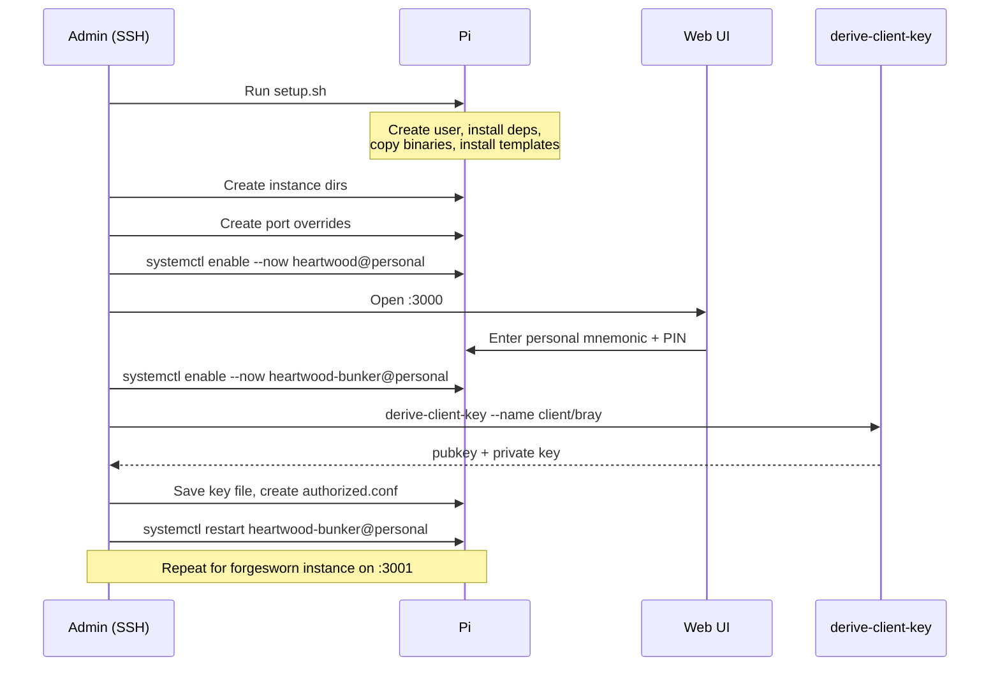

# Multi-Instance Bunker & Identity Tree Design

**Date:** 2026-04-02
**Status:** Draft
**Scope:** Identity tree convention, multi-instance systemd infrastructure, persistent client keys, optional Tor relay traffic

## Overview

Heartwood currently runs a single bunker instance with one master secret in a flat data directory. This design introduces:

1. A **namespaced identity tree** convention for organising derived keys by purpose
2. **Multi-instance bunker support** via systemd template units, allowing separate identities (personal, ForgeSworn, etc.) to run independently on the same device
3. **Persistent client keys** derived from nsec-tree, so NIP-46 clients like Bray and Bark authenticate with deterministic, recoverable keys
4. **Optional Tor relay traffic** per instance for IP privacy from relays

### Out of Scope

- Start9 / Umbrel packaging (grant work)
- Pi Zero 2 W optimisation (target is Pi 4/5)
- Multi-tenant single-process bunker (rejected in favour of multi-instance)
- Container-based deployment (future work)

## Architecture

### System Overview

```mermaid
graph TB
    subgraph Pi["Pi 4/5 (bitcoin5.local)"]
        subgraph Personal["Instance: personal"]
            RD1[heartwood<br/>Rust device :3000]
            BK1[heartwood-bunker<br/>Node.js sidecar]
            DD1[("/var/lib/heartwood/personal/")]
            RD1 --> DD1
            BK1 --> DD1
        end

        subgraph ForgeSworn["Instance: forgesworn"]
            RD2[heartwood<br/>Rust device :3001]
            BK2[heartwood-bunker<br/>Node.js sidecar]
            DD2[("/var/lib/heartwood/forgesworn/")]
            RD2 --> DD2
            BK2 --> DD2
        end

        TOR[Tor hidden service]
        RD1 -.-> TOR
        RD2 -.-> TOR
    end

    BRAY[Bray MCP] -->|NIP-46 via relays| BK1
    BARK[Bark extension] -->|NIP-46 via relays| BK1
    COOWNER[Co-owner's Heartwood] -->|same mnemonic| FSKEYS["Same ForgeSworn keys"]

    style Personal fill:#1b3d2d,stroke:#16c79a,stroke-width:2px
    style ForgeSworn fill:#2d1b3d,stroke:#e94560,stroke-width:2px
    style Pi fill:#0d1117,stroke:#30363d,stroke-width:2px
```



### Shared Mnemonic Model

Each instance holds its own mnemonic. Mnemonics can be shared with co-owners who run their own Heartwood instances — deterministic derivation guarantees identical keys from the same words.

```mermaid
graph LR
    subgraph Darren["Darren's Pi"]
        PM[personal mnemonic] --> PK1[persona/forgesworn]
        FM[forgesworn mnemonic] --> FK1[persona/forgesworn]
    end

    subgraph CoOwner["Co-owner's device"]
        FM2[forgesworn mnemonic] --> FK2[persona/forgesworn]
    end

    FM ---|same 24 words| FM2
    FK1 ---|identical keypair| FK2

    style Darren fill:#1b2d3d,stroke:#00b4d8,stroke-width:2px
    style CoOwner fill:#1b2d3d,stroke:#00b4d8,stroke-width:2px
```



## Identity Tree Convention

Every key derived from a Heartwood mnemonic uses a namespaced name passed to `derivePersona`. The `/` is part of the name string — no changes to derivation logic.

### Categories

| Prefix | Purpose | Used for |
|--------|---------|----------|
| `persona/` | Signing identities | Nostr events signed as this identity via `heartwood_switch` |
| `client/` | NIP-46 client auth | Tool's keypair for connecting to a bunker |
| `agent/` | Autonomous agents | AI agents that need their own Nostr identity |

### Derivation Examples

```
derivePersona(root, "persona/forgesworn", 0)   → ForgeSworn org signing key
derivePersona(root, "client/bray", 0)          → Bray's bunker connection key
derivePersona(root, "client/bark", 0)          → Bark's bunker connection key
derivePersona(root, "agent/dispatch", 0)       → dispatch agent identity
derivePersona(root, "client/bray/bot", 0)      → sub-agent of Bray
```

### HMAC Purpose String

The full string fed into HMAC-SHA256 is `nostr:persona:<name>` — the `nostr:persona:` prefix is added by `derive_persona` internally. For example, `client/bray` becomes `nostr:persona:client/bray`.

### Rules

- Names are lowercase, alphanumeric + `/` + `-`
- The prefix is the category, the suffix is the specific tool/identity
- Names support arbitrary depth via `/` (e.g. `client/bray/bot`) — the convention is suggestive, not enforced
- Index defaults to 0; increment for key rotation (e.g. `client/bray` index 1)
- Only `|` and `\0` are forbidden characters (derivation constraint)

## Multi-Instance Infrastructure

### Data Directory Layout

```
/var/lib/heartwood/
├── personal/
│   ├── master.secret            encrypted mnemonic (PIN-protected)
│   ├── bunker.key               bunker's own keypair (auto-generated)
│   ├── bunker-uri.txt           current bunker URI
│   ├── bunker-status.json       relay connectivity status
│   ├── clients.json             approved NIP-46 clients
│   ├── pending-clients.json     unapproved connection attempts
│   ├── config.json              relay list, tor_enabled, etc.
│   ├── personas.json            derived identities
│   ├── active-persona.json      currently active signing identity
│   ├── tor-hostname             .onion address (if Tor enabled)
│   └── client-keys/
│       ├── bray.hex             derived client private key (0600)
│       └── bark.hex             derived client private key (0600)
│
└── forgesworn/
    ├── master.secret
    └── ...                      identical file set
```

### Configuration

A single environment variable controls the data directory:

- **`HEARTWOOD_DATA_DIR`** — path to instance data directory
- Falls back to `/var/lib/heartwood` for backwards compatibility
- Set per-instance via systemd template: `Environment=HEARTWOOD_DATA_DIR=/var/lib/heartwood/%i`

Authorised client keys are also configured via environment variable:

- **`HEARTWOOD_AUTHORIZED_KEYS`** — comma-separated hex pubkeys, equivalent to `--authorized-keys` CLI flag
- Env var is preferred for systemd (no need to modify `ExecStart`)
- CLI flag takes precedence if both are set

### Systemd Template Units

**`heartwood@.service`** (Rust device):

```ini
[Unit]
Description=Heartwood signing appliance (%i)
After=network-online.target
Wants=network-online.target
StartLimitBurst=5
StartLimitIntervalSec=60

[Service]
Type=simple
User=heartwood
Group=heartwood
ExecStart=/usr/local/bin/heartwood
Restart=always
RestartSec=10
Environment=RUST_LOG=info
Environment=HEARTWOOD_DATA_DIR=/var/lib/heartwood/%i

# Security hardening
ProtectSystem=strict
ProtectHome=true
ReadWritePaths=/var/lib/heartwood/%i
NoNewPrivileges=true
PrivateTmp=true
CapabilityBoundingSet=
SystemCallFilter=@system-service
SystemCallErrorNumber=EPERM
MemoryDenyWriteExecute=true
RestrictRealtime=true
RestrictSUIDSGID=true
LockPersonality=true
ProtectKernelTunables=true
ProtectKernelModules=true
ProtectControlGroups=true
RestrictNamespaces=true
DevicePolicy=closed
DeviceAllow=/dev/i2c-1 rw

[Install]
WantedBy=multi-user.target
```

**`heartwood-bunker@.service`** (Node.js bunker):

```ini
[Unit]
Description=Heartwood NIP-46 bunker (%i)
After=network-online.target heartwood@%i.service
Wants=network-online.target
Requires=heartwood@%i.service
StartLimitBurst=5
StartLimitIntervalSec=60

[Service]
Type=simple
User=heartwood
Group=heartwood
WorkingDirectory=/opt/heartwood/bunker
ExecStart=/usr/bin/node index.mjs
Restart=always
RestartSec=15
Environment=NODE_ENV=production
Environment=HEARTWOOD_DATA_DIR=/var/lib/heartwood/%i

# Security hardening
ProtectSystem=strict
ProtectHome=true
ReadWritePaths=/var/lib/heartwood/%i
ReadOnlyPaths=/opt/heartwood
NoNewPrivileges=true
PrivateTmp=true
CapabilityBoundingSet=
SystemCallFilter=@system-service
SystemCallErrorNumber=EPERM
RestrictRealtime=true
RestrictSUIDSGID=true
LockPersonality=true
ProtectKernelTunables=true
ProtectKernelModules=true
ProtectControlGroups=true
RestrictNamespaces=true

[Install]
WantedBy=multi-user.target
```

### Per-Instance Overrides

Port assignment and authorised keys are set via systemd drop-in files:

```
/etc/systemd/system/heartwood@personal.service.d/port.conf
[Service]
Environment=HEARTWOOD_BIND=0.0.0.0:3000

/etc/systemd/system/heartwood-bunker@personal.service.d/authorized.conf
[Service]
Environment=HEARTWOOD_AUTHORIZED_KEYS=<bray_pubkey>,<bark_pubkey>
```

### Optional Tor Relay Traffic

Per-instance opt-in via override. Routes all bunker relay connections through Tor, hiding the device's IP from Nostr relays.

```
/etc/systemd/system/heartwood-bunker@forgesworn.service.d/tor.conf
[Service]
ExecStart=
ExecStart=torsocks /usr/bin/node index.mjs
```

**Trade-off:** Adds latency (seconds per hop) and reduces reliability. Recommended only for instances where IP privacy from relays matters more than signing speed.

## Persistent Client Keys

### Problem

NIP-46 clients (Bray, Bark) need a keypair to authenticate their bunker connection. If this keypair is ephemeral, the client gets a new pubkey on every restart and needs re-approval. The `--authorized-keys` feature becomes useless.

### Solution

Derive client keys from the same nsec-tree as signing identities. The keys are deterministic and recoverable from the mnemonic.

### Key Extraction

A local CLI tool derives the client private key without touching the network:

```bash
node derive-client-key.mjs --nsec <nsec> --name client/bray
# Output:
# Name:    client/bray
# Index:   0
# Pubkey:  ab12...cdef
# Secret:  98fe...4321  ← save this to a key file
```

The tool:
- Takes an nsec (or mnemonic) and a persona name
- Derives the key using nsec-tree's `derivePersona`
- Prints the pubkey and private key hex
- Does not persist anything — the caller saves the output

### Client Key Files

```
/var/lib/heartwood/personal/client-keys/
├── bray.hex       64-char hex private key, mode 0600
└── bark.hex       64-char hex private key, mode 0600
```

### Client Configuration

Bray reads its key file via existing `--bunker-key-file` flag:

```bash
bray --bunker-key-file /var/lib/heartwood/personal/client-keys/bray.hex \
     --bunker-uri bunker://<bunker_pk>?relay=wss://...
```

The corresponding pubkey goes into the bunker's `HEARTWOOD_AUTHORIZED_KEYS` env var.

### Security Properties

- Client key files are `0600`, owned by `heartwood` user
- The derive CLI tool runs interactively — nsec is in memory only during derivation
- `client-keys/` is inside the instance data dir, scoped by systemd sandboxing
- A leaked client key allows connecting to the bunker as that client, but not signing as the owner's Nostr identity — the bunker still controls signing and enforces kind restrictions and rate limits

## Setup Flow

Fresh install from bare Pi to running multi-instance.

### Sequence



### Adding a New Instance

1. Create `/var/lib/heartwood/<name>/` with `0700` perms, owned by `heartwood`
2. Create port override (next available port)
3. `systemctl enable --now heartwood@<name> heartwood-bunker@<name>`
4. Enter mnemonic via web UI
5. Derive client keys, create authorised keys override
6. Restart bunker instance

## Code Changes Required

### bunker/index.mjs

- Read `HEARTWOOD_DATA_DIR` env var, fall back to `/var/lib/heartwood`
- Read `HEARTWOOD_AUTHORIZED_KEYS` env var as alternative to `--authorized-keys` CLI flag (CLI takes precedence)

### heartwood-device (Rust)

- Read `HEARTWOOD_DATA_DIR` env var, fall back to `/var/lib/heartwood`
- (The device already reads `HEARTWOOD_BIND` from env — same pattern)

### New: derive-client-key.mjs

- Standalone CLI script in `tools/derive-client-key.mjs`
- Takes `--nsec <nsec>` or `--mnemonic <words>` and `--name <name>` and optional `--index <n>`
- Derives key via nsec-tree, prints pubkey and private key hex
- No network, no persistence

### pi/setup.sh

- Rewrite for multi-instance: create dirs, install template units, enable instances
- Parameterised instance creation

### pi/ service files

- Replace `heartwood.service` with `heartwood@.service` (template)
- Replace `heartwood-bunker.service` with `heartwood-bunker@.service` (template)

## Future Work

- **Start9 / Umbrel packaging** — container image with the same env var interface (grant work)
- **Web UI client key derivation** — PIN-protected page to derive and display client keys (replaces CLI tool)
- **Tor relay traffic** — evaluate latency impact and make a recommendation for default
- **Pi Zero 2 W** — resource-constrained deployment profile if demand warrants
